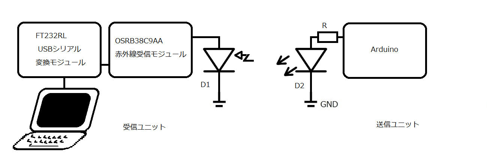
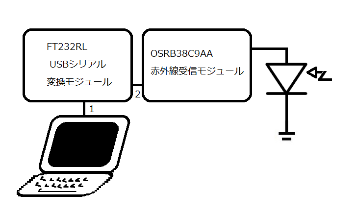
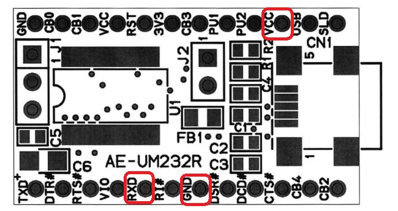
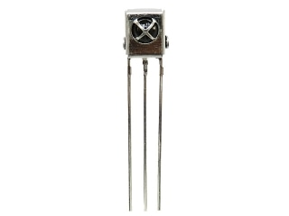
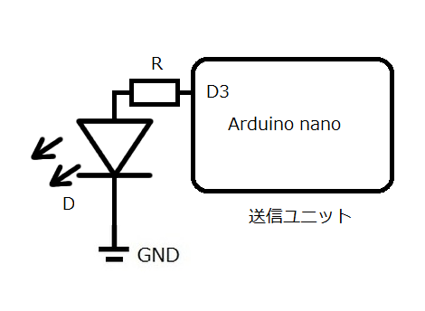

# 光通信振幅偏移変調
Optical Commnunication

# はじめに
前回はもっとも単純な方法で０か１を光通信で送る方法を紹介しました。これは光通信の歴史でいえば古代の「のろし」レベルでしたね。歴史になぞらえれば今回は符号を伝達できるようになります。やっとポルテグラフィー（Polybius Square / ポリュビオスの暗号）紀元前4世紀頃に歴史家ポリュビオスが考案した方法に追いついてきましたね。

# 振幅変調
デジタル変調における振幅変調（Amplitude Modulation: AM）は、デジタルデータを搬送波の振幅（信号の強さ）の変化に対応させて送信する方式です。最も基本的な振幅変調方式として、ASK (Amplitude Shift Keying)があります。

振幅偏移変調（ASK）の仕組み
ASKは、デジタルデータ（ビット列）に応じて搬送波の振幅を変化させる最もシンプルなデジタル変調方式です。

基本原理はASKでは、デジタル信号の「1」と「0」を、搬送波の異なる振幅レベルに対応させます。
ビット「1」: 搬送波の振幅を高いレベル（または通常の振幅）にします。
ビット「0」: 搬送波の振幅を低いレベル（または振幅をゼロ）にします。
この結果、信号はデジタルデータの「1」の時だけ存在し、「0」の時は消えるように見えます。

派生方式は最も一般的なASKの派生方式は、多値化によって一度に送れる情報量を増やす方式です。
OOK (On-Off Keying): これは最も単純なASKの一種で、「0」のときに振幅を完全にゼロにする（信号をオフにする）方式です。主にRFIDタグや光通信の分野で使われます。
多値ASK (M-ary ASK): 一つのシンボル（信号の塊）で2ビット以上の情報を送るために、4つ以上の異なる振幅レベルを使用します（例：4-ASKなら4つの振幅レベルで2ビットを表現）。

特徴と評価 💡
利点として単純な構造なので変調器と復調器の回路構成が非常にシンプルで安価に実現できます。

低コスト化がかのうです。特にOOKは、光通信などでも単純なオン・オフだけで信号を生成・検出できるため、コスト効率が良いです。

欠点
ノイズに弱い: 振幅の変化で情報を伝達するため、外部からのノイズや電波干渉、通信経路での信号の減衰（フェージング）など、振幅に影響を与える要因に極めて弱いです。ノイズによって振幅レベルが変わると、「1」と「0」の識別が難しくなり、エラー率が高くなります。

伝送効率: ASKは周波数帯域幅の利用効率（スペクトル効率）が、QAM（直交振幅変調）などの他の変調方式に比べて低い傾向にあります。

ASKは、シンプルさゆえに低速なデータ通信や、ノイズの影響が少ない環境（例：光ファイバーや近距離の無線通信）で主に利用されています。高速で信頼性の高い通信が求められる用途では、振幅と位相を組み合わせてノイズ耐性を高めたQAM（直交振幅変調）が主流となっています。

# 実験システムの構成

この図は本実験死システムの概要を示した図です。

送信ユニットでは赤外線にとあるアルファベットの符号を変調して送信します。前回はキーを接続してキーが押下されたときのみ赤外線を発する仕組みでしたが、今回は一定の間隔でアルファベットの符号を送信します。それ以外はハードウェア的には前回の送信ユニットと全く同じです。

そして送信ユニットとは空間で仕切られたところに受信ユニットはある。空間で仕切られているので電気的な手段で通信を試みることはできません。
受信ユニットのD1は赤外線に感度のあるフォトダイオードで外付けのように描いてありますが、実際は赤外線受信モジュールの中にあります。赤外線受信モジュールの出力は0あるいは1の羅列なのですがこれを受信した符号に対応するアルファベット文字に変換するのがFT232RL USBシリアル変換モジュールです。そしてこのモジュールはPCにUSBで接続されます。PC側からはこの変換モジュールは仮想シリアルポートとして認識されますの、Windows PCであればTeraterm等のターミナルソフトで受信した信号をアルファベット文字として見ることができます。

# 受信ユニット

この図は受信ユニットの構成を説明するものです。

また次の図はFT232RL USBシリアル変換モジュールのピン配列示すものです。

秋月電子通商の通販サイトより

そして次の図は赤外線受信モジュールのピン配列を示すものです。

秋月電子通商の通販サイトより

赤外線受信モジュールの出力は図でいうところの一番左の一番ピンはFT232RLモジュールの赤枠で囲んだRXDに接続します。
赤外線受信モジュールの一番右にある三番ピンはVCCはFT232RLから供給します。FT232RLのピン配列を示す図の赤枠で囲んだVCCに接続します。
グランドは赤外線受信モジュールの真ん中の2番ピンはFT232RLの赤枠で囲んだGNDに接続します。

# 送信ユニット

この図は送信ユニットの回路を示すものです。

前回キー接続していたD4がなくなっただけであとは同様なので、前回の記事の送信ユニットの下りをご参照ください。

# 送信ユニットのプログラミング

このリストは送信ユニットで動作するマイコン（Arduino）のプログラムです。

~~~
 1:void on(int num){
 2:   for(int i = 0; i < num; i++) {
 3:  PORTD |= 8;
 4:   delayMicroseconds(9);
 5:   PORTD &= ~8;
 6:   delayMicroseconds(17);
 7: }
 8:}
 
10: void setup(){
11:    pinMode(3, OUTPUT); 
12:  }

14:void loop(){
  //1000-0010 0x41 'A'
  //0111-1101
17:  on(32);
18:  delayMicroseconds((17+9)*32); //0
19:  on(32*5);                      //11111
20:  delayMicroseconds((17+9)*32); //0
21:  on(32);                       //1
22:  delay(200);
23:  }
~~~

1行目は赤外線LEDからONの信号を送出する関数です。引数にONの信号を生成する際、キャリア（38KHzの搬送波）を何度繰り返すかを指定します。一般に家庭用の赤外線リモコンの場合32となります。1ビットは搬送波32個分となります。3行目から6行目までは搬送波を生成するコードとなります。搬送波のパルスはデューティ比が50％ではありません。搬送波の波形は山が9マイクロ秒に対して谷が17マイクロ秒と谷の時間が山に比べて2倍近く長くなっています。

11行のsetup関数ではD3ピンを出力に設定しています。

14行目からがloop()関数になります。ここでASCIIコードの'A'の符号を送出しています。上位ビットから送出されますが最初の15行目はスタートビットです。一文字送り終えると200ミリ秒間をおきます。これを繰り返します。

# 実験

送信ユニットと受信ユニットを対面に置き、受信ユニットをUSBケーブルでPCに接続しTeratermで’A’の文字が一定間隔で画面に表示されるのを確認しました。

# おわりに

振幅変調はデジタル変調方式の中ではもっとも基本的な変調方式です。他のもっと高度な変調方式にも応用されています。次回以降様々な変調方式に挑戦してみたいと思います。お楽しみに。

