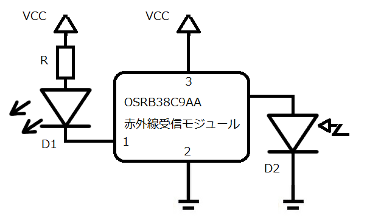
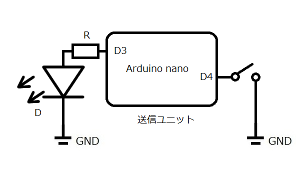
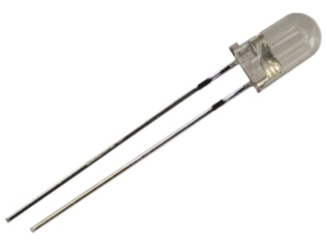
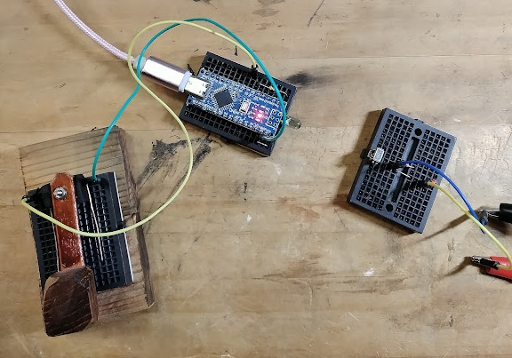

# 連載をはじめるにあたって
組込み技術者にとって今や電波の知識や経験はとても重要になってきました。しかし電波にかかわる実験や開発を行うには、電波法による規制に阻まれ、電波暗室等の設備のある組織でないと自由に行えないのが現状です。電波暗室のコストを考えると、電波を扱う研究や開発は中小企業やスタートアップが手を出しづらい分野でした。そこでこの連載は電波によく似た性質をもつ光を使った通信の基礎から応用までを紹介します。本連載で扱う光通信とは空間伝送をあつかいます。
紹介した変調方式には通信速度や信頼性において一長一短あり、それらを通信環境やコストなどの状況で使い分けや組み合わせなどの選択がなどが技術者の力量が試されるところです。
また最終回では教育効果の高いとされるコンテスト形式の演習手段であるCTF(Catch The Flag)を取り入れ、学んだ技術の定着をはかる試みに言及します。

今のところ以下の内容で連載を展開していく予定です。
- 光通信事始め
- 振幅偏移変調
- 周波数偏移変調
- 位相偏移変調
- 長距離通信への試み
- 通信速度対信頼性への挑戦
- コンテストの設計と実施

# 光通信事始め
Optical Communications

# はじめに
何回かに分けて光通信についてお話していきたいと思います。光通信といえば光ファイバー網を行きかうレーザー光を思い浮かべる読者も多いかと思いますが、ここで扱うの空間伝送です。空間伝送といえば携帯電話に代表されるように電波を用いるのが一般的ですが、様々な通信実験を行う際、電波にかかわる法律の制限が厳しくてなかなか安易に電波を出すことはできません。また電波暗室などの施設お使うことも考えられますが、施設の数が限られており、いつでも誰でもが利用できる状況にはありません。そこで電波と同様に空間伝送の実験ができ、様々な法律の制限を受けにく光を使うことを思いつきました。
以前（筆者が子供のころ、50年以上前）は電子工作の雑誌の中にはFMワイヤレスマイクというのが定番で大人気のアイテムでみな挙って作ったものです。これはいわゆる微弱電波を用いる機器の一種で、微弱電波の範疇を越えなければ誰でも作ったり使ったりできたのですが、最近はこの微弱電波に関しても様々な制限が加えられるようになりました。その関係かどうかはわかりませんが、電子工作系の雑誌からはこのワイヤレスマイクの製作記事は一切見かけなくなりました。このFMワイヤレスマイクを作ることはいわゆるラジオ少年が無線に目覚めるよい機会だと思っていたのですが、少し残念な気持ちを拭えません。

さてまず最初は単純に0か1を送る試みから始めたいと思います。

# 光通信の歴史
古代において、電気や電波を使わない「光」を用いた長距離通信は、主に視覚的な信号伝達によって実現されていました。これは現代の光ファイバー通信とは全く異なりますが、情報を光（炎や反射）に乗せて送るという意味で「光通信」と呼べます。

烽火（のろし）による通信
これは古代から世界中で最も広く使われた光通信の方法です。
仕組み: 遠くからでも見えるよう、高台や塔に監視所（のろし台）を設け、火や煙を上げて信号を送りました。
これは主に軍事目的で使われました。敵の襲来や危険を瞬時に遠方へ知らせるためのシンプルな警告信号です。
情報量は信号は単純で、「敵が来た」「安全だ」といった限られた情報しか伝えられませんでした。複雑な情報を伝えるには、事前に取り決められた複数ののろし台の位置や火の回数などでコード化する必要がありました。

太陽光の反射（ヘリオグラフの前身）
特定の場所や時代では、太陽の光を反射させて信号を送る方法も使われました。仕組みは磨かれた盾や鏡などを使い、太陽光を反射させて遠隔地に光の点滅を送りました。
用途として明るい日中に使用されました。のろしよりも微細な点滅を操作できるため、モールス信号のようにより多くの情報を伝えることが可能でした（古代ギリシャのポルテグラフィーなど、点滅の回数でアルファベットに対応させる試みもありました）。

古代ギリシャでは、のろしを用いた定量的な通信システムが考案されていました。ポルテグラフィー（Polybius Square / ポリュビオスの暗号）紀元前4世紀頃に歴史家ポリュビオスが考案したと言われる方法です。
仕組みはギリシャ語のアルファベットを縦5行、横5列のマス目に対応させます。情報を伝えたいとき、「行」を示すのろしと「列」を示すのろ*の2組の信号を使い分けました。
これにより、「敵が来た」といった単純な警告だけでなく、具体的な文章や単語を伝えることが可能となり、光通信の情報伝達能力を飛躍的に向上させました。
これらの古代の光通信は、現代のようなデータ伝送速度は持たないものの、瞬時の情報伝達という点で、古代の社会や軍事戦略において極めて重要な役割を果たしました。

## 実験システムの構成

この図は今回の光で信号を送る実験のための構成図です。

右が送信側で送信用の赤外線LED、マイコン（Arduino）そして送信の操作を行うキーで構成されています。送信側にマイコンが必要な理由は、これは後述しますが受信側のモジュールとの兼ね合いでである周波数の信号を乗せる必要があるからです。キーを押下すると赤外線LEDから赤外線信号が送出されます。
左が受信側で赤外線受信モジュールにモニター用のLED D1（これは可視光）を接続しただけの単純な構成になっています。D2は赤外線を受信する赤外線ダイオードですが、これは赤外線受信モジュールに内蔵されています。
送信側と受信側は空間で仕切られています。要は光は透過しますが、電気的には全く隔たれている状態です。
想定する動作としては送信側のキーを押下すると、受信側のD1 LEDが点灯します。ただ赤外線ですから普通の人間には見えません。もし送信側のLEDが本当に光を送出しているか見たい場合はスマホのカメラで確認することができます。ただ、最近の高級スマホであれば色補正のため赤外線をカットするフィルターが入ってることがあるそうです。

## 受信ユニット

この図は赤外線受信モジュールOSRB38C9AAです。

このモジュールは本来赤外線リモコンの受信モジュールとして使われているものです。
3本のリード線には番号がついていまして左から１番、これはこの受信モジュールの出力となります。オープンコレクターとなっています。真ん中の2番はGNDに接続します。一番右の3番はプラス電源を供給します。供給電圧のの範囲は2.7Vから5.5Vとなります。
赤外線リモコンには38KHzの搬送波が使われています。このモジュールもそれに対応しており、38Khzの信号のみ通すフィルターが内蔵されています。

この図は受信ユニットの回路図です。

モニター用のLED　D1は赤外線モジュールの出力がオープンコレクターなのでアノード側を抵抗を介して接続し、カソード側をモジュールの出力の１番に接続します。今回はRは100Ωにしています。

## 赤外線送信機ユニット

この図は赤外線送信ユニットの回路を示したものです。

ArduinoのD3に抵抗R（100Ω）を介して赤外線LEDに接続します。
D4にはキーを接続します。これを押下すると赤外線が送出されます。

ここの図は赤外線LEDです。

秋月電子通商の通販サイトより

OSI5LA5113Aという型番です。940nmの波長の赤外線を発します。詳しくをこの型番をキーワードでデーターシートを探してみてください。

このリストは送信ユニットマイコン（Arduino）で動作するプログラムです。

~~~
 1: void setup(){
 2:    pinMode(3, OUTPUT);
 3:    pinMode(4,INPUT_PULLUP); 
 4:    for(;;) if (digitalRead(4)==0){
 5:      PORTD |= 8;
 6:      delayMicroseconds(9);
 7:      PORTD &= ~8;
 8:      delayMicroseconds(17);
 9:      }
10: }
  
void loop(){};
~~~

3行目でキー入力はプルアップ抵抗付きで設定しています。
4行目でキー入力の値が0すなわち押下されているとき5行から8行までのコードを実行します。PORTDに直接値を書き込んでいますが、8はD4のピンを示します。このピンを9マイクロ秒ON、17マイクロ秒OFFにしています。26マイクロ秒が周期ですから周波数は約38KHｚになることがわかります。

## 実験

この図は実験風景を示した図です。

左下に見えるのがキーで、これを押下すると、その上の送信ユニットから38KHｚのキャリアを含む赤外線が送出されます。その対面が受信ユニットです。送信ユニットのキーを押下したときのみLEDが点灯することを確認しました。

# おわりに
今回は最もシンプルは方法で赤外線の送出と受信を確認しました。次回からはこれに何らかの符号を乗せる実験に移りたいとおもいます。　

